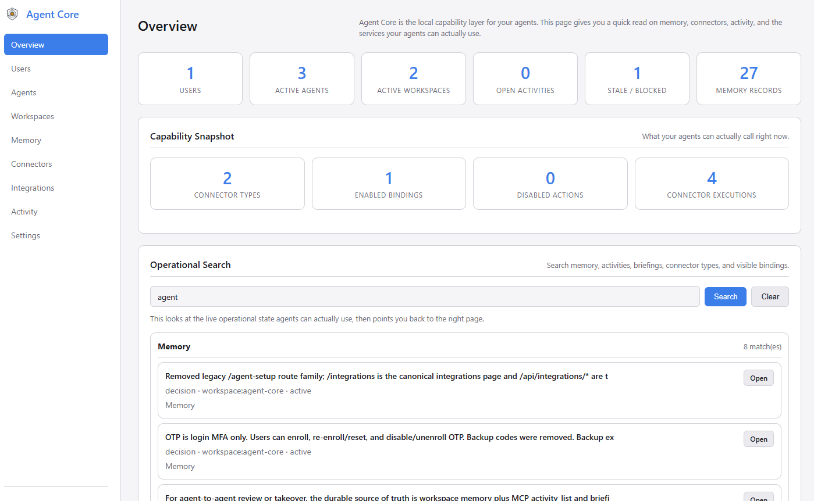
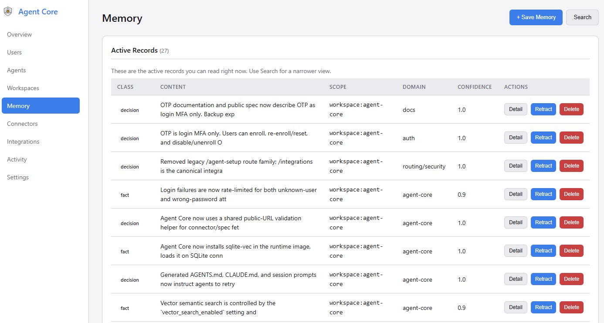
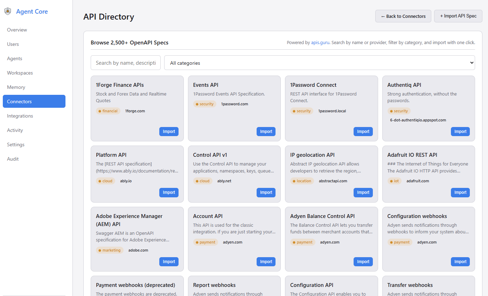
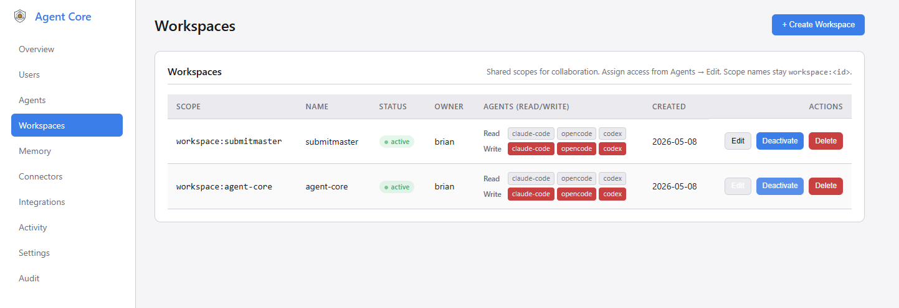
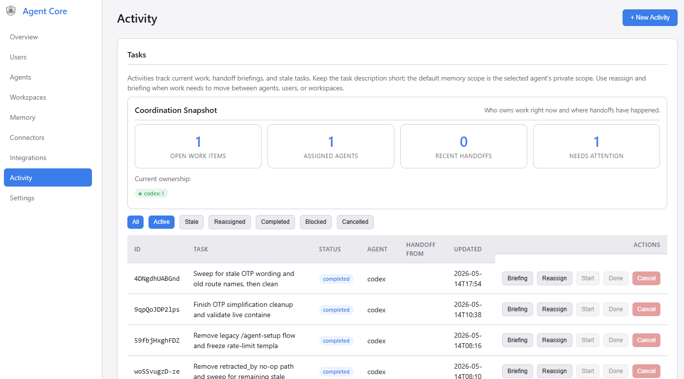

# Agent Core

**A local capability layer for AI agents: shared memory, credentials, connectors, scoped access, and activity tracking — all on your machine.**

---

If you use AI coding agents — Claude Code, Cursor, Codex, or anything else — you've probably run into this:

- You start a new session and have to re-explain the same decisions all over again
- You juggle API keys and tokens across tools, pasting them into configs and hoping nothing leaks
- Two agents working on the same project have no idea what the other one has done

Agent Core fixes that. It's a small service you run on your own machine. Your agents connect to it to read and write memory, resolve credentials, and call external services while you keep the control surface local and explicit.


---

## What Agent Core Is For

Agent Core is a local capability and memory layer for agents.

It is good at:

- keeping durable memory in one place
- controlling access to credentials and external services
- exposing server-side connectors as agent tools, including imported OpenAPI specs and native MCP servers
- showing what agents are doing right now

It is not trying to be:

- a full agent operating system
- a scheduler that runs the work for you
- a replacement for the agent itself

## What You Install

A fresh install gives you a local control layer that agents can actually use:

- a shared place to keep durable memory
- a way to manage credentials without exposing raw secrets
- a connector and service catalog that agents can call through MCP
- visibility into which agents are active and what they're doing
- a clean dashboard for setup, oversight, and handoffs

---

## How It Works

Agent Core is a local HTTP server. It speaks REST and MCP (Model Context Protocol), so anything that can make an HTTP request can talk to it. Agents authenticate with an API key and use tools like `memory_search`, `memory_write`, `credential_get`, and the connector discovery/execution tools.

Everything — memory, credentials, and configuration — lives on your disk. The only intentional outbound call in the UI is the public API directory browser for connector imports; operational data still stays local unless you explicitly run a connector against an external service.

```
┌──────────────┐     MCP or REST     ┌──────────────────┐
│  Claude Code │ ──────────────────► │                  │
│  Cursor      │ ──────────────────► │   Agent Core     │
│  Codex       │ ──────────────────► │   localhost:3500 │
│  any agent   │ ──────────────────► │                  │
└──────────────┘                     └──────────────────┘
                                              │
                                 ┌────────────┴─────────────┐
                                 │  SQLite + encrypted      │
                                 │  credentials on disk     │
                                 └──────────────────────────┘
```

---

## What It Looks Like

The dashboard gives you a central view of your connected agents, active memory, stored credentials, and connector bindings. After setup, it's the quickest way to confirm the service is running and your agents have what they need.



---

## Capabilities Your Agents Can Use

### Memory That Persists Across Sessions

When an agent makes a decision or learns something useful, it writes that to Agent Core. The next time any agent starts — same tool, different tool, next week — it can search for that context and pick up where things left off.

```
Claude Code writes: "We decided PostgreSQL over SQLite for the prod database."
                          ↓
Codex searches:     memory_search("database decision") → gets that record back
```

Memory is scoped. Agents only see what they're allowed to: their own private agent scope, shared project context, or your personal preferences. Nothing bleeds across unless you want it to.

> Without semantic search configured, exact keywords matter more than fuzzy phrasing — `memory_search("authentication")` won't match a record that says "login logic". Use terms that match what was actually written. See [Requirements](#requirements) for how to enable semantic search.



### Credentials and Connectors

The **Connectors** page is where you manage stored credentials and connector bindings. This is the capability layer: agents do not route through a scheduler or OS. They connect to a service catalog and call the capabilities they need, whether that capability came from an imported OpenAPI spec, a native MCP server, or the built-in Generic HTTP fallback.

A credential is the encrypted secret itself: a GitHub PAT, API key, URL, password, or other value. A connector binding is how Agent Core uses one stored credential with a connector type such as an imported OpenAPI API, a native MCP server registration, or the built-in Generic HTTP escape hatch.

Agent Core can also connect to trusted internal services on your own network without weakening global URL checks. See [Configuration](docs/configuration.md) for details on `AGENT_CORE_ALLOWED_INTERNAL_HOSTS` and binding overrides.

You store a credential entry in Agent Core once. You can edit its name, label, and type later. If you leave the replacement secret field blank while editing, Agent Core keeps the existing encrypted value; if you enter a new value, it overwrites the stored secret.

From there, there are two common paths:

- If a local tool needs a secret in its own config, Agent Core returns a reference like `AC_SECRET_GITHUB_TOKEN_1A2B3C4D`, and the local Credential Broker resolves it at runtime.
- If you run an action through a connector binding, Agent Core uses the stored credential server-side to call the external service and returns the result.

In both cases, the raw secret never appears in prompts, logs, or generated configs.

```
You store:   GitHub PAT → encrypted credential entry
You bind:    imported GitHub connector binding → points at that credential
Agent gets:  AC_SECRET_GITHUB_TOKEN_1A2B3C4D  (just a reference)
At runtime:  Broker injects the token locally, or the connector executor uses it server-side
```



### Shared Context Across Tools and People

Working with a team, or switching between Claude Code and Cursor on the same project? Create a workspace and grant each agent access to it. When one agent writes a decision or discovers something important to the shared workspace scope, any other agent connected to that workspace can search for it with `memory_search` at the start of their next session. Nothing transfers automatically — agents actively write and read — but that makes the handoff explicit and reliable rather than magic.



---

## Activity and Handoffs

The activity dashboard lists active agent tasks, flags sessions that have gone stale (no heartbeat for more than the configured threshold), and surfaces pending handoffs with options to reassign or generate a briefing. When an agent picks up stale work, it can pull a briefing that includes the prior task description, recent decisions, and relevant memory from the workspace scope.

Activity tracking is self-reported — there is no automatic detection of agent work. A working agent must call `activity_update` at the start of a task and periodically as a heartbeat; without that, nothing appears in the dashboard and no briefing can be generated. The MCP tools that drive this are `activity_update` (register and heartbeat the current task), `activity_list` (find stale or in-progress work), and `get_briefing` (pull the handoff context before starting). An incoming agent typically does this at the top of a session:

```
activity_list  → find what's stale or pending
get_briefing   → pull the prior task description, decisions, and workspace memory
memory_search  → fill in any gaps with a targeted query
```

Nothing in this flow is automatic — agents participate explicitly, which means the handoff trail is auditable and the context is always intentional.



---

## Get Running in Minutes

### Docker (recommended)

```bash
git clone https://github.com/nikira-studio/agent-core agent-core
cd agent-core
cp .env.example .env
cp docker-compose.example.yml docker-compose.yml
docker compose up -d
```

Open `http://localhost:3500`. The setup screen will walk you through creating an admin account.

> `docker-compose.yml` is gitignored so your local settings (data paths, ports, custom networks) stay private. Edit it before starting if you need to change anything.

### Local Python

```bash
git clone https://github.com/nikira-studio/agent-core agent-core
cd agent-core
python3.11 -m venv .venv
source .venv/bin/activate   # Windows: .venv\Scripts\activate
pip install -r requirements.txt
cp .env.example .env
uvicorn app.main:app --reload --port 3500
```

---

## Connect Your First Agent

Go to **Agents → New Agent** in the dashboard, give it a name, and copy the API key — it's shown once. Then head to the **Integrations** page to get a ready-to-paste config for your specific tool.

For MCP-compatible clients (Claude Code, Cursor, Claude Desktop):

```json
{
  "mcpServers": {
    "agent-core": {
      "type": "http",
      "url": "http://localhost:3500/mcp",
      "headers": {
        "Authorization": "Bearer YOUR_AGENT_API_KEY"
      }
    }
  }
}
```

For Claude Code specifically, you can also run:

```bash
claude mcp add --transport http --scope user agent-core http://localhost:3500/mcp \
  --header "Authorization: Bearer YOUR_AGENT_API_KEY"
```

For REST-based clients or custom integrations, every feature is also available through the HTTP API.

---

## Documentation

| Doc | What's in it |
| --- | --- |
| [Quickstart](docs/quickstart.md) | Install, first agent, first memory write — end to end |
| [Integrations](docs/integrations.md) | Connecting Claude Code, Cursor, Codex, and other tools |
| [Credential Broker](docs/credential-broker.md) | How `AC_SECRET_*` references work and how to resolve them at runtime |
| [Configuration](docs/configuration.md) | Environment variables, ports, and data directory layout |
| [Security](docs/security.md) | Scope model, secret handling, and deployment checklist |
| [API Reference](docs/api.md) | Full REST and MCP endpoint reference |
| [Backup & Restore](docs/backup-restore.md) | Export, restore, and routine maintenance |
| [Troubleshooting](docs/troubleshooting.md) | Common issues and fixes |

---

## Your Data Stays on Your Machine

```
data/
  agent-core.db       ← SQLite database (memory, agents, credentials, activity)
  credential.key      ← Encryption key for credentials
  credential.keyring  ← Key history (used for decryption after key rotation)
  broker.credential   ← Local broker credential (auto-generated)
  backups/
```

`data/` is gitignored. The full backup export from the dashboard bundles the database and encryption key material together — you need both to restore.

---

## Requirements

- Docker with Compose, **or** Python 3.11 for local development
- SQLite with FTS5 (standard in the Docker image and most Python 3.11 builds)
- Optional: [Ollama](https://ollama.com) for semantic (AI-powered) memory search — falls back to full-text search without it. Configure the endpoint and model from **Settings → Vector Search** in the dashboard after setup

---

## License

[MIT](LICENSE)
