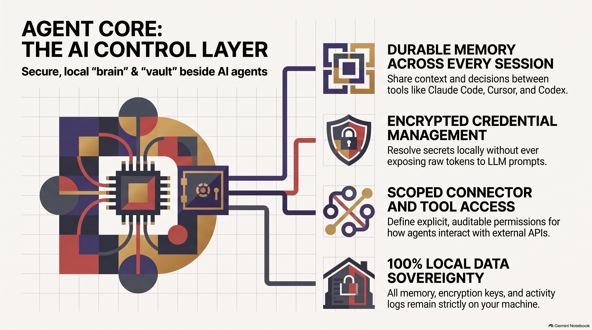
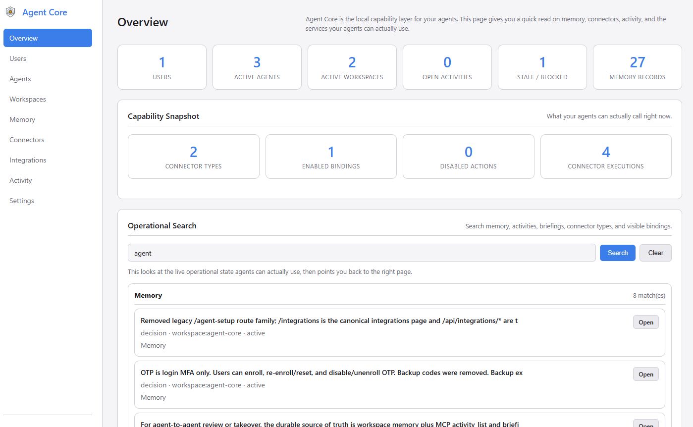
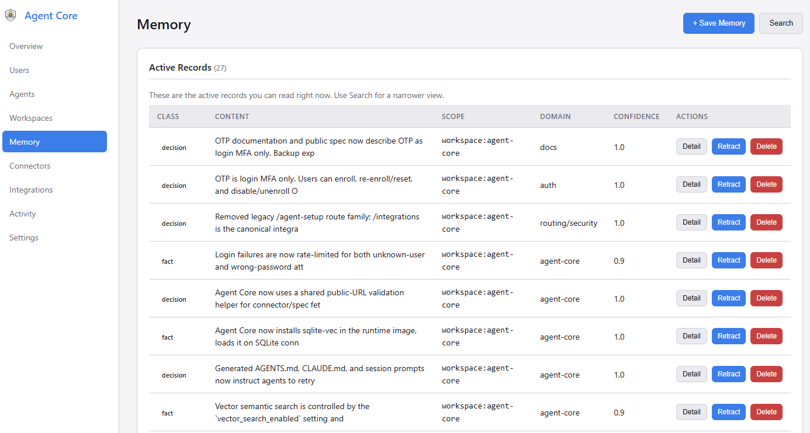
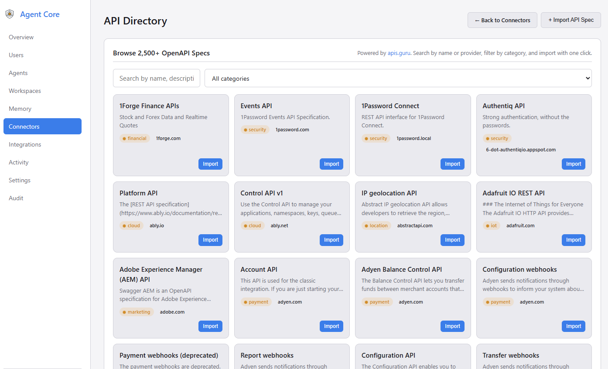
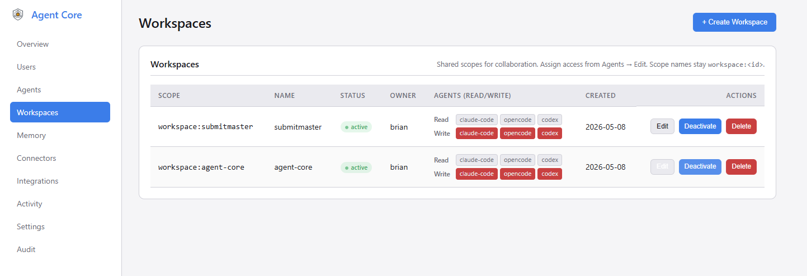
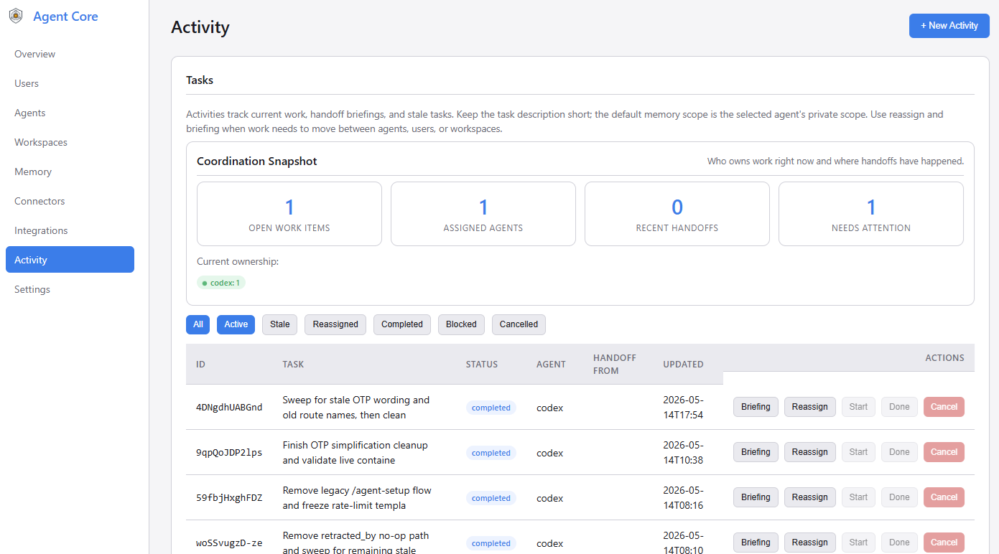

# Agent Core

**Shared memory and controlled capabilities for the agents you already use.**

Agent Core is a self-hosted MCP and HTTP service. It gives Claude Code, Codex, Cursor, and custom agents durable context, encrypted credentials, scoped connector access, and an auditable activity trail.

**Agent Core sits beside agents, not above them.**

---

If you use AI coding agents like Claude Code, Cursor, or Codex, you've probably run into this:

- You start a new session and have to re-explain the same decisions all over again
- You juggle API keys and tokens across tools, pasting them into configs and hoping nothing leaks
- Two agents working on the same project have no idea what the other one has done

Agent Core fixes that. It is a small service that you run on your own machine. Your agents connect to it to read and write memory, resolve credentials, and call external services, while the controls stay local and explicit.



---

## What Agent Core does

Agent Core provides:

- durable memory in one place
- access control for credentials and external services
- short-lived, narrowed authority for a single task, with human approval
- server-side connectors for imported OpenAPI specs, native MCP servers, and **adapters**, which are shareable data-manifest integrations for OAuth, session handshakes, and CLI wrappers (see [docs/adapters.md](docs/adapters.md))
- activity visibility and on-demand handoffs

Agent Core is not:

- an agent runtime or agent framework
- a coding assistant or computer-use environment
- a scheduler or orchestration engine
- a sandbox or cloud execution environment
- a replacement for the agent itself

## What you install

A fresh install gives you a local control layer that agents can actually use:

- a shared place to keep durable memory
- a way to manage credentials without exposing raw secrets
- a connector and service catalog that agents can call through MCP
- visibility into which agents are active and what they're doing
- a clean dashboard for setup, oversight, and handoffs

---

## How it works

Agent Core is a local HTTP server. It speaks REST and MCP (Model Context Protocol), so anything that can make an HTTP request can talk to it. Agents authenticate with an API key and use tools like `memory_search`, `memory_write`, `credential_get`, and the connector discovery/execution tools.

Memory, credentials, and configuration all live on your disk. The only intentional outbound call in the UI is the public API directory browser for connector imports; operational data still stays local unless you explicitly run a connector against an external service.

For the full picture, read **[How it works](docs/how-it-works.md)**: how memory is modelled, what keeps the corpus honest, how connectors and credentials fit together, and the reasoning behind each.

```
┌──────────────┐     MCP or HTTP     ┌────────────────────────────┐
│  Claude Code │ ──────────────────► │         Agent Core         │
│  Cursor      │ ──────────────────► │ shared memory              │
│  Codex       │ ──────────────────► │ encrypted credentials      │
│  any agent   │ ──────────────────► │ scoped connector access    │
└──────────────┘                     │ activity and handoffs      │
                                     └────────────┬───────────────┘
                                                  │
                       ┌──────────────────────────┴──────────────────────────┐
                       ▼                                                     ▼
          ┌─────────────────────────┐                         ┌─────────────────────────┐
          │ SQLite and encrypted    │                         │ External services       │
          │ credentials on your disk│                         │ via connector bindings  │
          └─────────────────────────┘                         └─────────────────────────┘
```

---

## What it looks like

The dashboard gives you a central view of your connected agents, active memory, stored credentials, and connector bindings. After setup, it's the quickest way to confirm the service is running and your agents have what they need.



---

## Capabilities your agents can use

### Memory that persists across sessions

When an agent makes a decision or learns something useful, it writes that to Agent Core. The next time any agent starts, whether it's the same tool, a different one, or a week later, it can search for that context and pick up where things left off.

```
Claude Code writes: "We decided PostgreSQL over SQLite for the prod database."
                          ↓
Codex searches:     memory_search("database decision") → gets that record back
```

Memory is scoped. Agents only see what they're allowed to: their own private agent scope, shared project context, or your personal preferences. Nothing bleeds across unless you want it to.

Memory records are one of two kinds, and the difference decides what the system can do with them. A **fact** is settled by checking: someone could verify it against the code, a host, or a service. A **decision** is settled by someone deciding, and nothing can verify it. That split is what lets Agent Core re-check facts on a schedule while leaving your decisions alone.

Facts can name what would confirm them (`repo:<path>`, `host:<name>`, `service:<binding>`), and the maintenance sweep checks them, recording what it found. Search results say how long it has been since anyone confirmed a record, so an agent can tell a fact verified today from one nobody has checked in months. Ranking follows the same principle: how often a record actually gets recalled and whether callers said it helped, rather than a score its author gave itself.

A few records can be **pinned** as standing context, the rules that apply whatever the task is. Those are loaded at the start of a session rather than retrieved, because a constraint that has to win a search can be missed. The list is capped so it stays short enough to actually read.

There is also a **clean-up review** in the dashboard. Rules look for records that no longer earn their place and propose them: one-off job logs, repeats, claims whose subject has vanished. Nothing is applied until you answer, retracting is reversible, and each kind of suggestion keeps a record of how often you agreed with it.

> Without semantic search configured, exact keywords matter more than fuzzy phrasing. `memory_search("authentication")` won't match a record that says "login logic", so use terms that match what was actually written. See [Requirements](#requirements) for how to enable semantic search.



### Credentials and connectors

The **Connectors** page is where you manage stored credentials and connector bindings. This is the capability layer: agents do not route through a scheduler or OS. They connect to a service catalog and call the capabilities they need, whether that capability came from an imported OpenAPI spec, a native MCP server, an installed adapter, or the built-in Generic HTTP fallback.

A credential is the encrypted secret itself: a GitHub PAT, API key, URL, password, or other value. A connector binding is how Agent Core uses one stored credential with a connector type such as an imported OpenAPI API, a native MCP server registration, an installed adapter, or the built-in Generic HTTP escape hatch.

Agent Core can also connect to trusted internal services on your own network without weakening global URL checks. See [Configuration](docs/configuration.md) for details on `AGENT_CORE_ALLOWED_INTERNAL_HOSTS` and binding overrides.

You store a credential entry in Agent Core once. You can edit its name, label, and type later. If you leave the replacement secret field blank while editing, Agent Core keeps the existing encrypted value; if you enter a new value, it overwrites the stored secret.

From there, there are two common paths:

- If a local tool needs a secret in its own config, Agent Core returns a reference like `AC_SECRET_GITHUB_TOKEN_1A2B3C4D`, and the local Credential Broker resolves it at runtime.
- If you run an action through a connector binding, Agent Core uses the stored credential server-side to call the external service and returns the result.

In both cases, the raw secret never appears in prompts, logs, or generated configs.

```
You store:   GitHub PAT → encrypted credential entry
You bind:    imported GitHub connector binding → points at that credential
Agent gets:  AC_SECRET_GITHUB_TOKEN_1A2B3C4D  (just a reference)
At runtime:  Broker injects the token locally, or the connector executor uses it server-side
```



### Shared context across tools and people

Working with a team, or switching between Claude Code and Cursor on the same project? Create a workspace and grant each agent access to it. At session startup, an agent calls `workspace_sync` to receive pinned context, assigned activities, new briefings, and workspace changes since that execution's last acknowledged cursor. Targeted `memory_search` calls still fill gaps when the agent needs older context.

Sync is an explicit pull, not a background process. Each session has its own execution ID, even when two sessions use the same agent identity. That lets one Codex session see work recorded by another Codex session without confusing the two sessions.



### Short-lived authority for agent teams

Standing scopes fit the agents you use every day. Sometimes an agent should get access for one task only: a coordinator handing work to a worker agent, a nightly job that needs a single connector action, a new tool you aren't ready to trust with anything permanent.

For that, Agent Core supports **delegation**, the local version of the temporary credentials cloud providers issue (AWS STS, OAuth token exchange). A grant is always a subset of what its issuer holds, expires within an hour, and *replaces* the recipient's normal access while in use instead of adding to it. Agents that lack authority can request it; the request lands on your dashboard, where you approve it, narrow it, or deny it. No secret ever passes through a model, and every delegated action is attributed in the audit log from the agent that asked to the agent that acted.

This is what lets any framework that coordinates worker agents sit on top of Agent Core without every worker holding broad permanent credentials. Coordination stays in your framework; Agent Core stays the layer that holds identity, authority, and audit. See [How it works](docs/how-it-works.md#7-delegation-authority-for-one-task) for the mechanism and the [Delegated Authorization contract](docs/delegated-authorization-integration.md) for integration details.

---

## Activity and handoffs

The activity dashboard lists active agent tasks, flags sessions that have gone stale (no heartbeat for more than the configured threshold), and surfaces pending handoffs with options to reassign or generate a briefing. When an agent picks up stale work, it can pull a briefing that includes the prior task description, recent decisions, and relevant memory from the workspace scope.

Activity tracking is self-reported. There is no automatic detection of agent work: a working agent must call `activity_update` at the start of a task and periodically as a heartbeat. Without that, nothing appears in the dashboard and no briefing can be generated.

The trail is searchable, and it is the right home for "what did we do on X last month". Durable memory is for what stays true; the activity trail is for what happened. Agents that record per-task progress in memory instead get told so on write.

You can assign work to an agent directly from the dashboard (**Activity → Assign Work**). The agent session discovers that work on the next pickup check:

```
workspace_sync    → receive new workspace context and changes for this execution
workspace_sync_ack → acknowledge a delivered page after processing it
activity_pickup  → check for work a human assigned to this agent in this workspace
activity_search  → search what agents have already worked on ("what did we do on X")
activity_list    → find what's stale or pending (for reviews and handoffs)
get_briefing     → pull the prior task description, decisions, and workspace memory
memory_search    → fill in any gaps with a targeted query
```

`workspace_sync` reports what changed. `activity_pickup` claims the next task assigned to the agent, or returns `null` if nothing is waiting. Both are explicit pulls. Agents call them at session boundaries and task boundaries, not on a background schedule.



---

## Get running in minutes

### Docker (recommended)

```bash
git clone https://github.com/nikira-studio/agent-core agent-core
cd agent-core
cp .env.example .env
cp docker-compose.example.yml docker-compose.yml
docker compose up -d
```

Open `http://localhost:3500`. The setup screen will walk you through creating an admin account.

> `docker-compose.yml` is gitignored so your local settings (data paths, ports, custom networks) stay private. Edit it before starting if you need to change anything.

### Local Python

```bash
git clone https://github.com/nikira-studio/agent-core agent-core
cd agent-core
python3.11 -m venv .venv
source .venv/bin/activate   # Windows: .venv\Scripts\activate
pip install -r requirements.txt
cp .env.example .env
uvicorn app.main:app --reload --port 3500
```

---

## Connect your first agent

Go to **Agents → New Agent** in the dashboard, give it a name, and copy the API key. It's shown once. Then head to the **Integrations** page to get a ready-to-paste config for your specific tool.

For MCP-compatible clients (Claude Code, Cursor, Claude Desktop):

```json
{
  "mcpServers": {
    "agent-core": {
      "type": "http",
      "url": "http://localhost:3500/mcp",
      "headers": {
        "Authorization": "Bearer YOUR_AGENT_API_KEY"
      }
    }
  }
}
```

For Claude Code specifically, you can also run:

```bash
claude mcp add --transport http --scope user agent-core http://localhost:3500/mcp \
  --header "Authorization: Bearer YOUR_AGENT_API_KEY"
```

For REST-based clients or custom integrations, every feature is also available through the HTTP API.

---

## Documentation

| Doc | What's in it |
| --- | --- |
| [How it works](docs/how-it-works.md) | The whole system end to end: memory, activity, credentials, connectors, and why each part works the way it does |
| [Quickstart](docs/quickstart.md) | Install, first agent, first memory write, end to end |
| [Integrations](docs/integrations.md) | Connecting Claude Code, Cursor, Codex, and other tools |
| [Credential Broker](docs/credential-broker.md) | How `AC_SECRET_*` references work and how to resolve them at runtime |
| [Configuration](docs/configuration.md) | Environment variables, ports, and data directory layout |
| [Security](docs/security.md) | Scope model, secret handling, and deployment checklist |
| [Delegated Authorization](docs/delegated-authorization-integration.md) | Lending agents short-lived, narrowed authority, and the contract for coordinators and agent runtimes |
| [API reference](docs/api.md) | Full REST and MCP endpoint reference |
| [Backup and restore](docs/backup-restore.md) | Export, restore, and routine maintenance |
| [Troubleshooting](docs/troubleshooting.md) | Common issues and fixes |

---

## Your data stays on your machine

```
data/
  agent-core.db       ← SQLite database (memory, agents, credentials, activity)
  credential.key      ← Encryption key for credentials
  credential.keyring  ← Key history (used for decryption after key rotation)
  broker.credential   ← Local broker credential (auto-generated)
  backups/
```

`data/` is gitignored. The full backup export from the dashboard bundles the database and encryption key material together. You need both to restore.

---

## Requirements

- Docker with Compose, **or** Python 3.11 for local development
- SQLite with FTS5 (standard in the Docker image and most Python 3.11 builds)
- Optional: [Ollama](https://ollama.com) for semantic (AI-powered) memory search. Without it, Agent Core falls back to full-text search. Configure the endpoint and model from **Settings → Vector Search** in the dashboard after setup

---

## License

[MIT](LICENSE)
